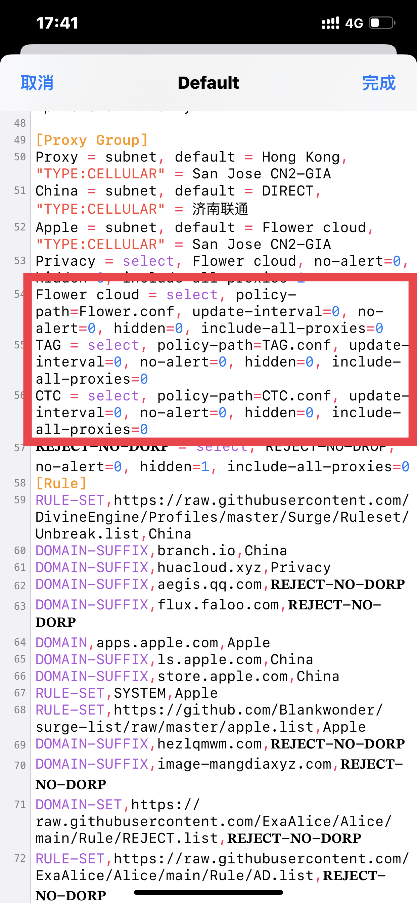

# 多机场订阅

可通过UI快速配置：\[首页]->\[通用]->\[代理服务器]->\[新增策略组]->\[使用外部代理列表]->\[粘贴订阅或者本地节点文件（带后缀名）]

或者通过编辑配置文件配置：

配置方案1:&#x20;

`[Proxy Group]` \
`Proxy = select, 机场1, 机场2, 机场3, 聚合 机场1 = select, policy-path=机场1的Surge托管配置 机场2 = select, policy-path=机场2的Surge托管配置 机场3 = select, policy-path=机场3的Surge托管配置 聚合 = select, include-other-group="机场1, 机场2, 机场3", policy-regex-filter=节点筛选(比如:HK|HONGKONG|香港)`\

配置方案2(隐藏机场的策略): \
`[Proxy Group]` \
`Proxy = select, 聚合 机场1 = select, policy-path=机场1的Surge托管配置, hidden=true 机场2 = select, policy-path=机场2的Surge托管配置, hidden=true 机场3 = select, policy-path=机场3的Surge托管配置, hidden=true 聚合 = select, include-other-group="机场1, 机场2, 机场3", policy-regex-filter=节点筛选(比如:HK|HONGKONG|香港)`

**举例：**\
`[Proxy Group]` \
\
`所有机场合集 = select,Flower cloud，TAG，CTC , update-interval=0, no-alert=0, hidden=0, include-all-proxies=0` \
\
`Flower cloud = select, policy-path=Flower.conf, update-interval=0, no-alert=0, hidden=0, include-all-proxies=0` \
\
`TAG = select, policy-path=TAG.conf, update-interval=0, no-alert=0, hidden=0, include-all-proxies=0` \
\
`CTC = select, policy-path=CTC.conf, update-interval=0, no-alert=0, hidden=0, include-all-proxies=0`

<figure><figcaption></figcaption></figure>

 

<figure><figcaption></figcaption></figure>

 

<figure><figcaption></figcaption></figure>

也可通过Sub-Store第三方工具处理多机场订阅。\
\
